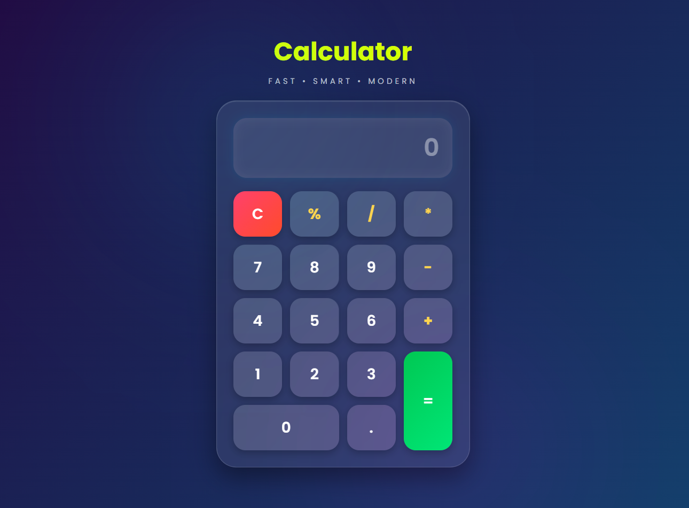

# 🧮 Calculator

A simple and modern calculator built using HTML, CSS, and JavaScript.

## ✨ Features

- Addition, Subtraction
- Multiplication, Division
- Percentage Calculation
- Decimal Support
- Clear Button
- Responsive Design

## 🚀 Technologies Used

- HTML
- CSS
- JavaScript

## 📸 Preview

Modern calculator with a clean and attractive user interface.

